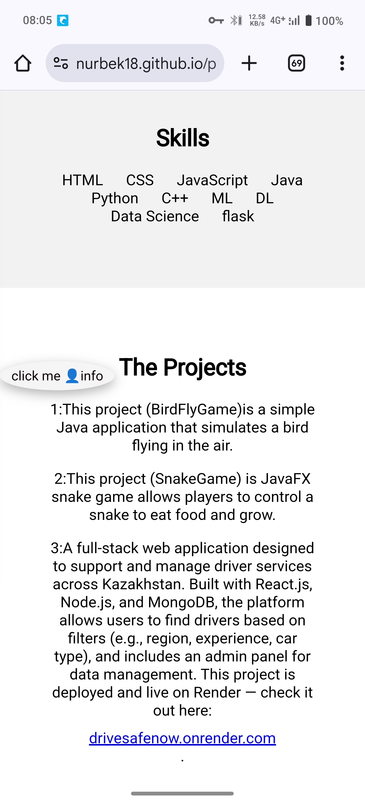
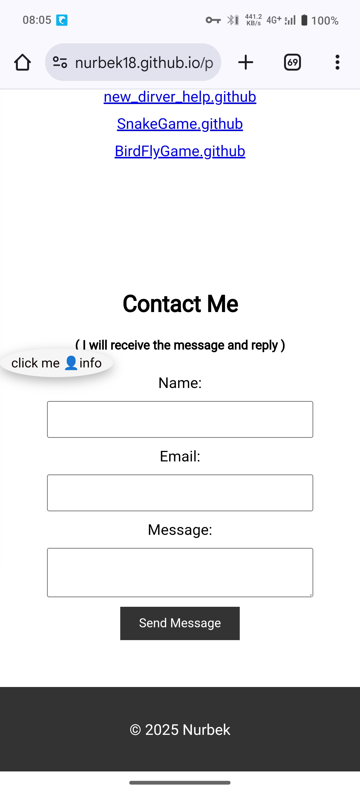

# Personal Web Portfolio

Welcome to my personal portfolio website! This project showcases my work, skills, and contact information in a modern and interactive way. The website is built using **HTML, CSS, and JavaScript**, and is designed to be responsive and visually appealing.

## Features

- **Home** – Introduction and welcome message.
- **About** – A brief introduction about me and my background.
- **Skills** – List of programming languages, tools, and technologies I use.
- **Projects** – A gallery of my featured projects with links and descriptions.
- **Contact** – A contact form or details to get in touch with me.

## Technologies Used

- HTML5
- CSS3 (including animations)
- JavaScript (Vanilla JS)

## Screenshots

Here are some real screenshots of the website:

### Homepage


### About Section


### Skills Section


### Projects Section


> These images are located in the this repository.

## How to Use (Local Setup)

1. Clone the repository:
   ```bash
   git clone https://github.com/nurbek18/personalweb.git

2. Navigate into the project folder:

cd personalweb


3. Open index.html in your browser:

On Windows: double-click index.html

On Mac/Linux: run open index.html or xdg-open index.html


Deployment (GitHub Pages)

You can deploy this site using GitHub Pages:

Steps:

1. Push your latest code to the main branch.


2. Go to your repository on GitHub.


3. Click Settings > Pages (left sidebar).


4. Under "Source", select main branch and / (root) folder.


5. Click Save.


Your website will be published at:

https://nurbek18.github.io/personalweb

> It may take a few minutes to go live.


Live Demo

Click here to view the website

Author

Nurbek
GitHub Profile

License

This project is licensed under the MIT License - see the LICENSE file for details.

---
